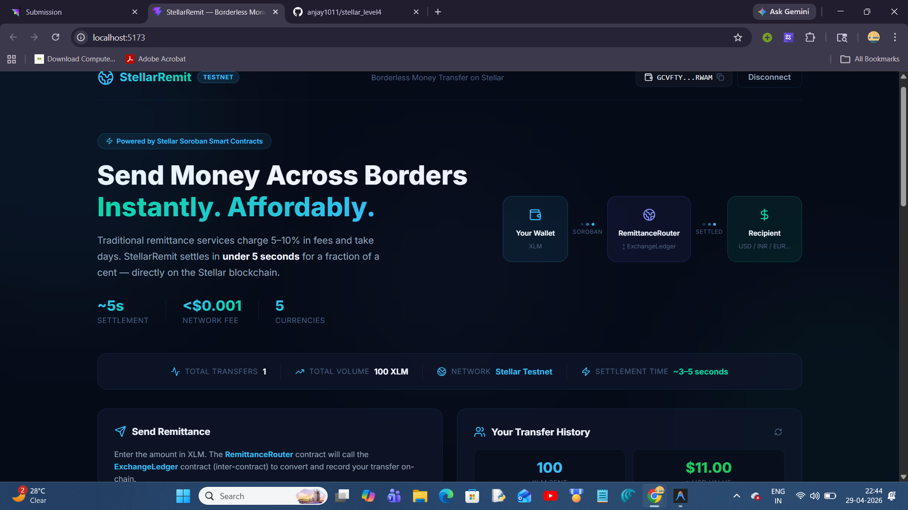
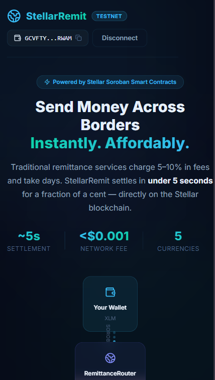

# 🌍 StellarRemit — Decentralized Cross-Border Remittance (Green-Belt Project)

> **Solving a $50B problem**: Migrant workers worldwide pay 5–10% in fees to services like Western Union. StellarRemit cuts that to near-zero using Stellar's Soroban smart contracts — settling in seconds, not days.

---

## 🎯 Real-World Problem & Solution:-

### The Problem-
Over **200 million migrants** send money home to support 800+ million family members. Traditional remittance services (Western Union, MoneyGram) charge **5–10% fees** and take **2–5 business days**. For someone earning minimum wage, that's a significant portion of their paycheck lost to middlemen.

### How Stellar Solves It
Stellar was designed specifically for cross-border payments. With **3–5 second finality** and fees of **~0.0001 XLM** per transaction, StellarRemit demonstrates how blockchain makes remittances:
- **10–100x cheaper** than traditional services
- **1000x faster** than bank wires
- **Fully transparent** — every transfer is auditable on-chain
- **Accessible to the unbanked** — only a mobile wallet needed

### Why This Matters
The World Bank estimates that reducing remittance fees to 3% would keep **$20 billion more** in the hands of recipients annually. At Stellar's fee structure, that number could be even higher.

---

## 🧪 Real-World Use Case (Step-by-Step) :-

A migrant worker in the USA wants to send $100 to their family in India.

1. The sender opens StellarRemit and connects their wallet.
2. They enter the amount in XLM and select INR as the destination currency.
3. The RemittanceRouter contract is triggered, which securely processes the transaction.
4. The contract calls ExchangeLedger to convert XLM into INR using predefined exchange rates.
5. The converted amount is recorded and transferred on-chain within seconds.
6. The recipient receives the funds almost instantly with minimal fees.

This process eliminates intermediaries like banks or remittance services, reducing costs from 5–10% to near-zero while ensuring full transparency and speed.

---

## ✨ Features:-

- **🔗 Inter-Contract Architecture** — `RemittanceRouter` calls `ExchangeLedger` via `env.invoke_contract()`, demonstrating real Soroban cross-contract communication in a meaningful context.
- **💱 Multi-Currency Support** — USD, EUR, INR, PHP, MXN corridors with on-chain exchange rate simulation.
- **📊 Real-Time Stats** — Live transfer count, global volume, and per-user savings vs. traditional services.
- **📡 Live Event Streaming** — Contract events polled every 15 seconds with animated feed.
- **📱 Mobile Responsive** — Optimized for users on mobile wallets.
- **⚡ CI/CD Pipeline** — GitHub Actions for automated contract testing on every push.
- **🎨 Premium UI** — Dark glassmorphism with animated flow diagrams and conversion previews.

---

## 🏗️ Contract Architecture:-

```
User Wallet
     │
     │  send_remittance(xlm_amount, dest_currency)
     ▼
┌────────────────────────────────┐
│      RemittanceRouter          │  ← "vault" contract
│  - Tracks per-user XLM sent   │
│  - Tracks global volume        │
│  - Emits on-chain events       │
│                                │
│  env.invoke_contract() ────────┼──────► ┌────────────────────────┐
│                                │        │    ExchangeLedger       │  ← "token" contract
└────────────────────────────────┘        │  - Applies FX rates     │
                                          │  - Records conversions  │
                                          │  - Supports rate oracle │
                                          └────────────────────────┘
```

The inter-contract call is the core of this architecture: the Router atomically calls the Ledger to get the converted amount in a single Stellar transaction — no multi-step coordination needed.

---

## 📄 Contract Information

- **Network**: Stellar Testnet
- **RemittanceRouter Contract ID**: [`CALUMWUGTN2STIK2CUUOGWUENIM354J5YCBZHACRY6HOUVCJWH5GB6EW`](https://stellar.expert/explorer/testnet/contract/CALUMWUGTN2STIK2CUUOGWUENIM354J5YCBZHACRY6HOUVCJWH5GB6EW)
- **ExchangeLedger Contract ID**: [`CCE6P2J7TGH7ALYNK7XP6GA3FLXJ4IZDOHXRVNAOHPJHQSB52HLPV7GW`](https://stellar.expert/explorer/testnet/contract/CCE6P2J7TGH7ALYNK7XP6GA3FLXJ4IZDOHXRVNAOHPJHQSB52HLPV7GW)
- **Deploy Transaction (Router)**: [`ab2a63f318fa8a3304f245fcb5a1f2bee2fe21561de59d40763e0ecbe9d2b05b`](https://stellar.expert/explorer/testnet/tx/ab2a63f318fa8a3304f245fcb5a1f2bee2fe21561de59d40763e0ecbe9d2b05b)
- **Deploy Transaction (Ledger)**: [`40f70c47f9b6ae313d3b6862e7956aa910e070d6928e49effdaa3dd8c3efccb5`](https://stellar.expert/explorer/testnet/tx/40f70c47f9b6ae313d3b6862e7956aa910e070d6928e49effdaa3dd8c3efccb5)

### RemittanceRouter Functions
| Function | Description |
|----------|-------------|
| `send_remittance(exchange_ledger, sender, amount_xlm, dest_currency_code)` | Routes transfer, calls ExchangeLedger inter-contract |
| `get_user_total(user)` | Returns total XLM sent by address |
| `get_remittance_count()` | Global transfer count |
| `get_global_volume()` | Total XLM volume processed |

### ExchangeLedger Functions
| Function | Description |
|----------|-------------|
| `record_transfer(sender, amount_xlm, dest_currency_code)` | Records and converts remittance |
| `get_rate(currency_code)` | Returns FX rate for currency |
| `set_rate(currency_code, rate)` | Admin: update oracle rate |
| `get_total_received(sender)` | Per-sender converted total |

### Supported Corridors
| Code | Currency | Rate (per XLM) |
|------|----------|----------------|
| 1 | 🇺🇸 USD | 0.11 |
| 2 | 🇪🇺 EUR | 0.10 |
| 3 | 🇮🇳 INR | 9.16 |
| 4 | 🇵🇭 PHP | 6.37 |
| 5 | 🇲🇽 MXN | 1.94 |

---

## 🛠 Tech Stack

| Layer | Technology |
|-------|-----------|
| **Smart Contracts** | Rust (Soroban SDK v25) |
| **Frontend** | React 19 + Vite 5 |
| **Stellar SDK** | @stellar/stellar-sdk v15 |
| **Wallet** | Freighter (via @stellar/freighter-api) |
| **CI/CD** | GitHub Actions |
| **Styling** | Vanilla CSS (glassmorphism) |

---

## 🌐 Live Demo

[View Live dApp on Vercel](https://stellar-x-green-belt.vercel.app/)

---

## 📸 Screenshots

### Desktop View


### Mobile Responsive View


### Video 


https://github.com/user-attachments/assets/eb97c5a6-2eb9-454f-ab2a-d08d172f0fcb


### CI/CD Pipeline
[](https://github.com/anjay1011/stellar_level4/actions/workflows/ci.yml)

---

## 🧪 Testing

```text
running 3 tests
test test::test_send_remittance_usd ... ok
test test::test_send_remittance_inr ... ok
test test::test_multiple_remittances_accumulate ... ok

test result: ok. 3 passed; 0 failed; 0 ignored; 0 measured; 0 filtered out; finished in 0.05s
```

---

## 🏁 Setup & Installation

### 1. Clone Repository
```bash
git clone https://github.com/anjay1011/stellar_level4.git
cd stellar_level4
```

### 2. Contract Setup
```bash
cd contract
stellar contract build
# Deploy ExchangeLedger first
stellar contract deploy --wasm target/wasm32v1-none/release/token.wasm --source <your-id> --network testnet
# Deploy RemittanceRouter
stellar contract deploy --wasm target/wasm32v1-none/release/vault.wasm --source <your-id> --network testnet
```

### 3. Frontend Setup:-
```bash
cd frontend
npm install
npm run dev
```

---

## ✅ Submission Checklist:-

- [x] **Clear real-world problem**: Cross-border remittances with 5-10% traditional fees
- [x] **Stellar value-add**: 3-5s settlement, near-zero fees, transparent on-chain audit
- [x] **Inter-contract call working**: RemittanceRouter → ExchangeLedger
- [x] **Multi-currency FX conversion**: USD, EUR, INR, PHP, MXN
- [x] **CI/CD pipeline**: GitHub Actions with automated tests
- [x] **Mobile responsive design**
- [x] **8+ meaningful commits**
- [x] **README with problem statement, architecture, and value proposition**
- [x] **Live demo link**
- [x] **Screenshots: mobile + CI/CD**

---

*Built for the Stellar Frontend Challenge — Level 4 Green Belt*
*Real problem. Real solution. Powered by Stellar.*
